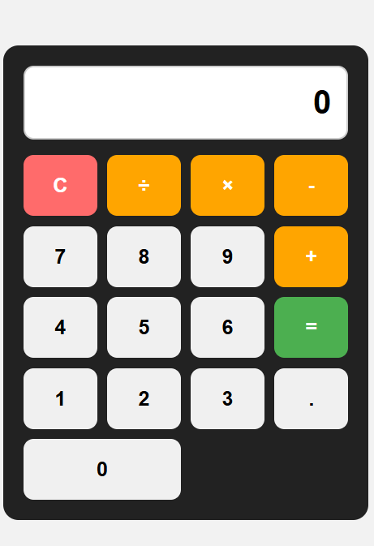

# Calculator App

A simple calculator web app built with HTML, CSS, and JavaScript.

This project was created as part of my journey learning web development and building projects for my portfolio.

## Live Demo

[Try the calculator] https://michaelatano.github.io/calculator-app/

## Features

- Addition, subtraction, multiplication, and division
- Decimal number support
- Clear button
- Keyboard controls
- Division-by-zero error handling
- Simple and easy-to-use interface

## Technologies Used

- HTML
- CSS
- JavaScript
- Git
- GitHub

## What I Learned

Building this calculator helped me practise:

- Working with HTML to structure a webpage
- Using CSS to create a clean and responsive layout
- Using JavaScript to handle user input and calculations
- Working with variables and functions
- Handling keyboard and mouse input
- Using Git and GitHub to track and manage my code
- Debugging problems and improving my code as I built the project

## How to Run

1. Clone this repository.
2. Open the project folder.
3. Open `index.html` in your web browser.
4. Start using the calculator.